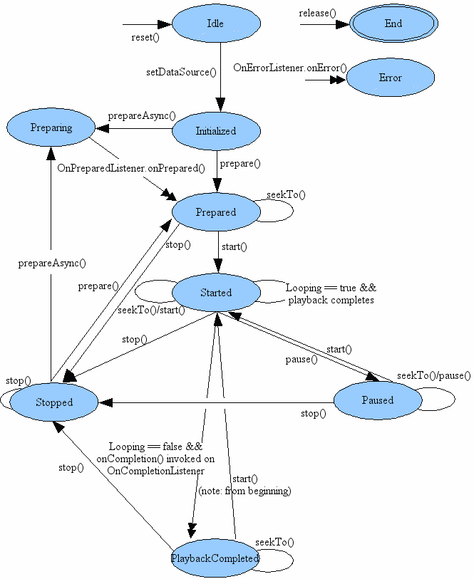

# 音乐播放器

#Basic
说道音乐播放就涉及到两个重要的类`MediaPlayer`、`AuidoManager`。
* [MediaPlayer](https://developer.android.com/reference/android/media/MediaPlayer.html)  这个类提供了核心的播放音频和视频的API
* [AudioManager](https://developer.android.com/reference/android/media/AudioManager.html)  这个类主要管理设备上audio资源和audio的输出

这两个类的关系有点类似Soldier和Commander的关系，soldier只负责打战，至于打哪里，什么时候开火都需要Commander来统一调度。


#清单文件配置
在使用MediaPlayer时，用到一些featrue，需要在清单文件中声明。

* **Internet Permission** 如果播放的是网络资源时需要。
  ```
  <uses-permission android:name="android.permission.INTERNET" />
  ```
* **Wake Lock Permission** 如果需要应用在屏幕变暗或者CPU睡眠的过程中继续运行，可以调 用*MediaPlayer.setScreenOnWilePlaying()* 或者 *MediaPlayer.setWakeMode()*方法，这时就需要这个权限。
  ```
  <uses-permission android:name="android.permission.WAKE_LOCK" />
  ```
  
#开始使用

如何使用MediaPlayer播放音频或者视频资源可以参考官网[MediaPlayer类](https://developer.android.com/reference/android/media/MediaPlayer.html)，播放的控制类似于一个状态机，这里我还是觉得这个张图对整个播放状态描述比较直接。





* 使用MediaPlayer时prepare的时候一般会用异步等待，避免ANR。如果是一些比较小的本地音频就没有这个必要了。
* 使用过程中我们只要记住一点MediaPlayer是基于状态的，进行下一个操作严格依赖上一个状态，否则会抛异常。
* MediaPlayer是非常消耗系统资源的，再不用的时候要及时释放。

#后台播放

关于应用后台播放应用需要使用Service，这里有涉及到一个`remote service` or `local service`，以下是我自己使用过程中的体会（以下都是基于Nexus4，OSVsersion 4.4）：

##Remote service
 这里会涉及几个问题：
 * 跨进程通讯<br/>
    跨进程通讯方式我就不讨论，可以用AIDL，Message。
 * 多个进程共享数据<br/>
    共享数据一般用的是 SharedPreferences 和 DataBase。<br/>
    如果是SharedPreferences，这需要将MODE设置为`MODE_MULTI_PROCESS`，但是你会发现这个模式已经被废弃掉了，所以被抛弃了；如果使用`DataBase`则需要使用`Observable`将自己的数据接口暴露出去。
 * 通过远程服务在应用退出或者从后台remove的时候可以继续播放，当然国产的手机remove的时候依然会kill掉所有相关的服务。（具体的效果可以依照网易云音乐来实现，我想他们应该会测试很多种情况，如果他都没办法继续播放就别折腾了）

总得来说用这种方式实现的话会进程通讯和数据同步需要写很多代码。

## Local Service

本地服务只需要保证APP从前台退出的时候依然播放，这里通过`startService()`是可以实现，唯一要处理的地方就是从最近打开应用列表REMOVE掉的时候，后台服务也会被kill掉。有兴趣的可以看看这个帖子[Foreground service killed when receiving broadcast after acitivty swiped away in task list](https://code.google.com/p/android/issues/detail?id=53313)


